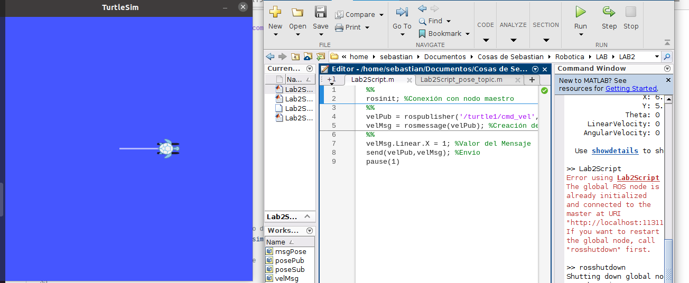

# LABORATORIO 2.
## ROBOTICA 2022-2
### Julian Camilo Velandia & Sebastian Cubides Toscano.
***
### 1. Conexión de ROS con MATLAB:

Se siguío el procedimiento descrito en la guía [1], creando 3 scripts, uno para darle movimiento a la tortuga, otro para suscribirse al tópico de la pose de la tortuga y el último para enviar los valores asociados a la pose de la tortuga. 

Los scripts de MATLAB se encuentran nombrados según su función.

En la siguiente imagen se observan los resultados.

***
### 2. Conexión de ROS con PYTHON:

